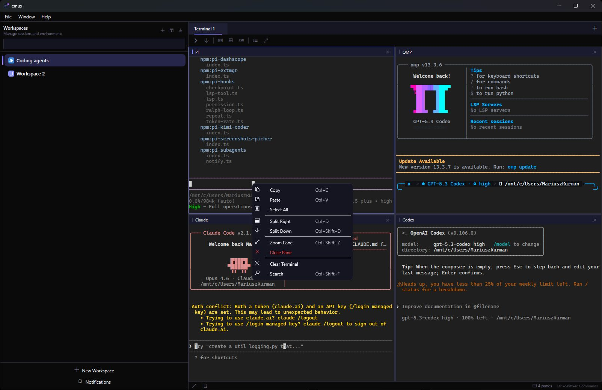
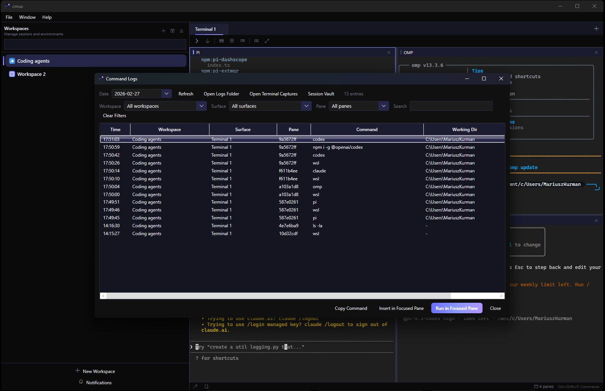
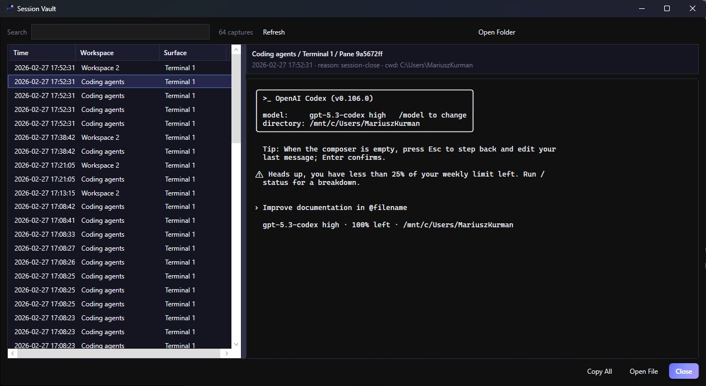

# cmux for Windows

A dark, keyboard-first terminal multiplexer for Windows, inspired by tmux/cmux workflows but built natively with WPF + ConPTY.

---

## Why / Who / What / How

| Why (problem) | Who (for) | What (feature) | How to use |
|---|---|---|---|
| You lose context across projects and shells | Developers juggling many repos/tasks | **Workspaces + surfaces (tabs)** | `Ctrl+N` new workspace, `Ctrl+T` new surface, switch with `Ctrl+1..9` |
| One terminal is never enough | CLI-heavy users, agent workflows | **Split panes** (right/down) | `Ctrl+D` split right, `Ctrl+Shift+D` split down, `Ctrl+Alt+Arrow` focus pane |
| You miss important agent outputs | AI-assisted coding users (Claude/Codex/etc.) | **OSC notifications + unread tracking** | `Ctrl+I` open notifications, `Ctrl+Shift+U` jump to latest unread |
| You need auditability of executed commands | Security-conscious / debugging workflows | **Command logs + history picker** | `Ctrl+Shift+L` logs, `Ctrl+Alt+H` command history, insert/run from UI |
| You want full session recall after crashes/restarts | Long-running sessions | **Session persistence + transcript capture** | Auto restore on startup + open **Session Vault** (`Ctrl+Shift+V`) |
| You want searchable output history like Termius vault | Anyone reviewing terminal sessions | **Session Vault browser** | Open vault, filter captures, preview transcript, copy/open file |
| You need dark theme consistency and personalization | Users who care about UX/readability | **Dark UI + terminal theme customization** | Settings (`Ctrl+,`) for colors/font/cursor + workspace accents |
| You want quick actions without mouse hunting | Keyboard-first power users | **Command palette + shortcuts** | `Ctrl+Shift+P` command palette, menu mirrors key flows |
| You need automation from scripts/tools | Integrators/agent hooks | **Named pipe CLI API** (`cmux`) | `cmux notify`, `cmux workspace`, `cmux split`, `cmux status` |

---

## Core capabilities

- Native **ConPTY terminal emulation** (real Windows terminal backend)
- Workspace sidebar with metadata (git branch, cwd, notifications)
- Multi-surface tabs and split-pane layout management
- Notification ingestion (OSC 9/99/777) for coding agents
- Command logs/history with filtering and quick replay
- Terminal transcript capture + Session Vault browsing
- Persistent sessions (window + workspace/surface/pane state)
- Dark desktop UI with keyboard-first navigation

---

## Screenshots

<details>
  <summary>Open screenshots</summary>

  <p><strong>Main workspace view</strong></p>
  

  <p><strong>Snippets panel</strong></p>
  

  <p><strong>Command logs window</strong></p>
  
</details>

---

## Build and run (Windows)

### Requirements

- Windows 10/11
- [.NET 10 SDK](https://dotnet.microsoft.com/download)
- Optional: Visual Studio 2022 / Build Tools

### Clone

```powershell
git clone <repo-url> cmux-windows
cd cmux-windows
```

### Dev run

```powershell
dotnet build Cmux.sln -c Debug
dotnet run --project src/Cmux/Cmux.csproj -c Debug
```

---

## Build `.exe` on Windows

### 1) Framework-dependent `.exe` (smallest output)

```powershell
dotnet publish src/Cmux/Cmux.csproj -c Release -r win-x64 --self-contained false -o publish/cmux-win-x64
```

Output:
- `publish/cmux-win-x64/cmux.exe`

Use this when target machines already have .NET runtime installed.

### 2) Self-contained `.exe` (no runtime install needed)

```powershell
dotnet publish src/Cmux/Cmux.csproj -c Release -r win-x64 --self-contained true -o publish/cmux-win-x64-sc
```

Output:
- `publish/cmux-win-x64-sc/cmux.exe`

### 3) Single-file self-contained `.exe` (portable artifact)

```powershell
dotnet publish src/Cmux/Cmux.csproj -c Release -r win-x64 --self-contained true /p:PublishSingleFile=true /p:PublishTrimmed=false -o publish/cmux-win-x64-single
```

Output:
- `publish/cmux-win-x64-single/cmux.exe`

> Note: WebView2-backed features may require WebView2 Runtime depending on target system state.

### Build CLI executable

```powershell
dotnet publish src/Cmux.Cli/Cmux.Cli.csproj -c Release -r win-x64 --self-contained true -o publish/cmux-cli
```

Add `publish/cmux-cli` to `PATH` to use `cmux` globally.

---

## First 5 minutes (how to use)

1. Launch `cmux.exe`
2. `Ctrl+N` to create a workspace for your repo
3. `Ctrl+T` to create additional surfaces (tabs)
4. Split panes with `Ctrl+D` / `Ctrl+Shift+D`
5. Open command palette with `Ctrl+Shift+P` for quick actions
6. Open logs with `Ctrl+Shift+L`
7. Open Session Vault with `Ctrl+Shift+V`
8. Open settings with `Ctrl+,` and tune terminal theme/font/cursor

---

## Keyboard shortcuts

### Workspaces

| Shortcut | Action |
|---|---|
| `Ctrl+N` | New workspace |
| `Ctrl+1..8` | Jump to workspace 1..8 |
| `Ctrl+9` | Jump to last workspace |
| `Ctrl+Shift+W` | Close workspace |
| `Ctrl+Shift+R` | Rename workspace |
| `Ctrl+B` | Toggle sidebar |

### Surfaces (tabs)

| Shortcut | Action |
|---|---|
| `Ctrl+T` | New surface |
| `Ctrl+W` | Close surface |
| `Ctrl+Shift+]` | Next surface |
| `Ctrl+Shift+[` | Previous surface |
| `Ctrl+Tab` / `Ctrl+Shift+Tab` | Cycle surfaces |

### Panes

| Shortcut | Action |
|---|---|
| `Ctrl+D` | Split right |
| `Ctrl+Shift+D` | Split down |
| `Ctrl+Alt+Arrow` | Focus adjacent pane |
| `Ctrl+Shift+Z` | Zoom/unzoom pane |

### Productivity

| Shortcut | Action |
|---|---|
| `Ctrl+Shift+P` | Command palette |
| `Ctrl+Shift+F` | Search overlay |
| `Ctrl+Shift+L` | Command logs |
| `Ctrl+Shift+V` | Session vault |
| `Ctrl+Alt+H` | Command history picker |
| `Ctrl+,` | Settings |

---

## CLI usage

```powershell
# Send a notification (e.g., from agent hooks)
cmux notify --title "Claude Code" --body "Waiting for input"

# Workspace management
cmux workspace list
cmux workspace create --name "My Project"
cmux workspace select --index 0

# Surface/pane actions
cmux surface create
cmux split right
cmux split down

# Inspect status
cmux status
```

---

## Architecture (high level)

```text
src/
  Cmux/         WPF desktop app (views, controls, themes)
  Cmux.Core/    terminal engine, models, services, persistence, IPC
  Cmux.Cli/     command-line client for automation
tests/
  Cmux.Tests/   unit tests
```

---

## License

MIT
