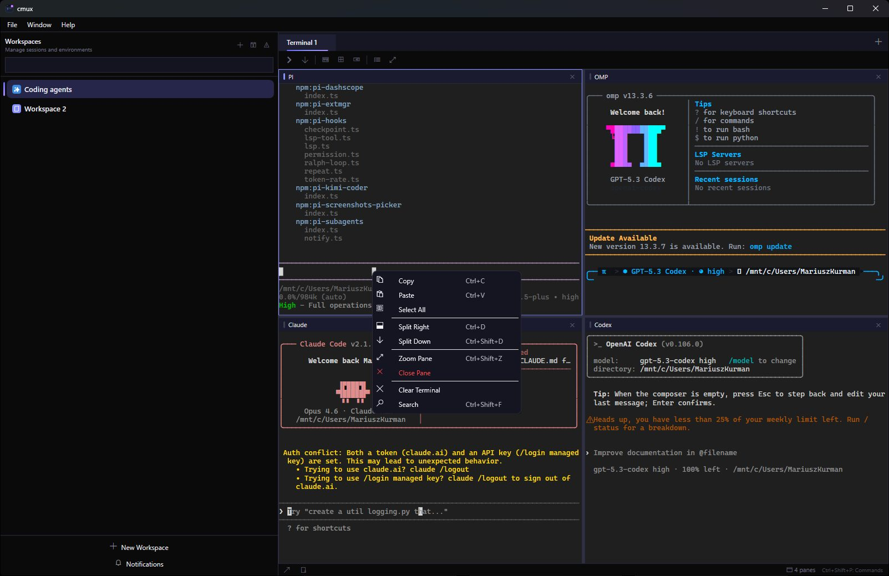
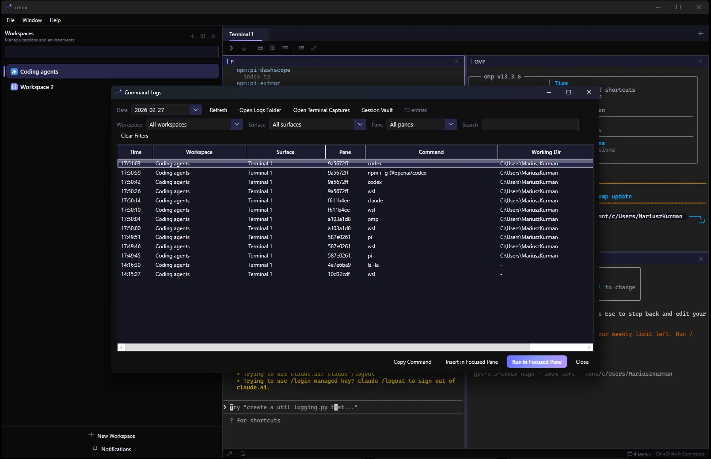
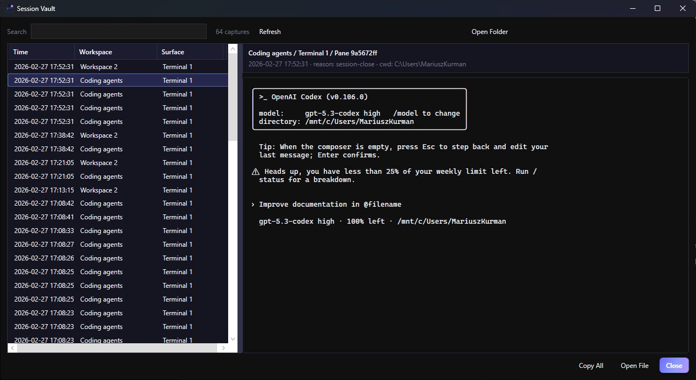

# cmux for Windows

A keyboard-first terminal multiplexer for Windows, inspired by tmux/cmux workflows but built natively with WPF + ConPTY. Ships with both Dark and Light themes plus 22 named palette variants (Catppuccin, Dracula, GitHub, Nord, One, Rose Pine, Tokyo Night, Solarized, Gruvbox, Everforest, Monokai) — flip via Settings → Appearance → Mode + App Theme.

---

## ⚠️ Status: work in progress — lots of stuff is broken

This is an actively evolving fork. Expect rough edges. Known categories of brokenness as of right now:

- **Persistence is unreliable.** Reopening the app does not always restore terminals to the directory they were closed in. `cd`-tracking inside PowerShell relies on a prompt-injection shim that's still being shaken out — if you launch a non-default shell or have a heavily customized `$PROFILE`, your mileage will vary.
- **Daemon discovery is fragile.** If you run a published build that doesn't have `cmux-daemon.exe` next to `cmuxw.exe`, every terminal silently falls back to in-process ConPTY (you'll see `[Connect] Timeout` in `%LOCALAPPDATA%\cmux\daemon-debug.log`). The "Build `.exe`" section below has the publish commands for all three required binaries.
- **Custom WPF templates may have gaps that haven't been noticed yet.** A previous version of the brand dictionary defined a custom `MenuItem` template without a `<Popup>`, which silently broke every submenu in the app — that's been swept (ModernWpf now owns menu styling) but similar landmines could exist in other places.
- **OSC notification handling, command-log capture, transcript persistence** all have edge cases that have eaten data in past sessions. Don't rely on cmux as your only record of anything important.
- **No installer.** You build it yourself and run the resulting `cmuxw.exe`.
- **Settings UI** doesn't cover everything the engine supports; some behavior is only configurable by editing `%LOCALAPPDATA%\cmux\settings.json` directly.
- **Tests are thin.** The xUnit project covers core models and a handful of services, not the WPF layer or the full IPC round-trip.

If you want a stable, finished product, this isn't it yet. If you want a hackable Windows terminal multiplexer with the source right there, welcome.

---

## Why / Who / What / How

| Why (problem) | Who (for) | What (feature) | How to use |
|---|---|---|---|
| You lose context across projects and shells | Developers juggling many repos/tasks | **Workspaces + surfaces (tabs)** | `Ctrl+N` new workspace, `Ctrl+T` new surface, switch with `Ctrl+1..9` |
| One terminal is never enough | CLI-heavy users, agent workflows | **Split panes** (right/down) | `Ctrl+D` split right, `Ctrl+Shift+D` split down, `Ctrl+Alt+Arrow` focus pane |
| You miss important agent outputs | AI-assisted coding users (Claude/Codex/etc.) | **OSC notifications + unread tracking** | `Ctrl+I` open notifications, `Ctrl+Shift+U` jump to latest unread |
| You need auditability of executed commands | Security-conscious / debugging workflows | **Command logs + history picker** | `Ctrl+Shift+L` logs, `Ctrl+Alt+H` command history, insert/run from UI |
| You want full session recall after crashes/restarts | Long-running sessions | **Session persistence + transcript capture** | Auto restore on startup + open **Session Vault** (`Ctrl+Shift+V`) |
| You want searchable output history like Termius vault | Anyone reviewing terminal sessions | **Session Vault browser** | Open vault, filter captures, preview transcript, copy/open file |
| You need a UI that fits your light/dark preference and a terminal that fits your eyes | Users who care about UX/readability | **Light/Dark app theme + 24 terminal palettes** | Settings (`Ctrl+,`) → Appearance for app Mode + variant; Terminal for renderer palette + font/cursor; per-workspace accents in the sidebar context menu |
| You want quick actions without mouse hunting | Keyboard-first power users | **Command palette + shortcuts** | `Ctrl+Shift+P` command palette, menu mirrors key flows |
| You need automation from scripts/tools | Integrators/agent hooks | **Named pipe CLI API** (`cmux`) | `cmux notify`, `cmux workspace`, `cmux split`, `cmux status` |

---

## Core capabilities

- Native **ConPTY terminal emulation** (real Windows terminal backend)
- Workspace sidebar with metadata (git branch, cwd, notifications)
- Multi-surface tabs and split-pane layout management
- Notification ingestion (OSC 9/99/777) for coding agents
- Command logs/history with filtering and quick replay
- Terminal transcript capture + Session Vault browsing
- Persistent sessions (window + workspace/surface/pane state)
- Light/Dark app theme with 22 named palette variants (Default, Catppuccin, Dracula, GitHub, Nord, One, Rose Pine, Tokyo Night, Solarized, Gruvbox, Everforest, Monokai)
- 24 built-in terminal renderer palettes, custom-color override, and Ghostty-config-file fallback
- Keyboard-first navigation with full command palette + customizable shortcuts

---

## Screenshots

<details>
  <summary>Open screenshots</summary>

  <p><strong>Main workspace view</strong></p>
  

  <p><strong>Snippets panel</strong></p>
  

  <p><strong>Command logs window</strong></p>
  
</details>

---

## Build and run (Windows)

### Requirements

- Windows 10/11
- [.NET 10 SDK](https://dotnet.microsoft.com/download)
- Optional: Visual Studio 2022 / Build Tools

### Clone

```powershell
git clone <repo-url> cmux-windows
cd cmux-windows
```

### Dev run

```powershell
dotnet build Cmux.sln -c Debug
dotnet run --project src/Cmux/Cmux.csproj -c Debug
```

---

## Build `.exe` on Windows

> **Important:** cmux ships as **three** executables that must coexist in the same directory:
> - `cmuxw.exe` — the WPF app
> - `cmux-daemon.exe` — out-of-process ConPTY host (lets terminals survive a UI crash/restart)
> - `cmux.exe` — the CLI (`cmux notify`, `cmux split`, etc.)
>
> If `cmux-daemon.exe` is missing, the app still launches but every terminal falls back to in-process ConPTY — you'll see `[Connect] Timeout after 300ms` in `%LOCALAPPDATA%\cmux\daemon-debug.log` and lose the daemon's persistence/restart-survival benefits.
>
> Each section below publishes all three into the **same** `-o` directory. Run all three commands in the section, in order.

### 1) Framework-dependent `.exe` (smallest output)

```powershell
dotnet publish src/Cmux/Cmux.csproj            -c Release -r win-x64 --self-contained false -o publish/cmux-win-x64
dotnet publish src/Cmux.Daemon/Cmux.Daemon.csproj -c Release -r win-x64 --self-contained false -o publish/cmux-win-x64
dotnet publish src/Cmux.Cli/Cmux.Cli.csproj    -c Release -r win-x64 --self-contained false -o publish/cmux-win-x64
```

Output:
- `publish/cmux-win-x64/cmuxw.exe`
- `publish/cmux-win-x64/cmux-daemon.exe`
- `publish/cmux-win-x64/cmux.exe`

Use this when target machines already have the .NET runtime installed.

### 2) Self-contained `.exe` (no runtime install needed)

```powershell
dotnet publish src/Cmux/Cmux.csproj            -c Release -r win-x64 --self-contained true -o publish/cmux-win-x64-sc
dotnet publish src/Cmux.Daemon/Cmux.Daemon.csproj -c Release -r win-x64 --self-contained true -o publish/cmux-win-x64-sc
dotnet publish src/Cmux.Cli/Cmux.Cli.csproj    -c Release -r win-x64 --self-contained true -o publish/cmux-win-x64-sc
```

Output:
- `publish/cmux-win-x64-sc/cmuxw.exe`
- `publish/cmux-win-x64-sc/cmux-daemon.exe`
- `publish/cmux-win-x64-sc/cmux.exe`

### 3) Single-file self-contained `.exe` (portable artifact)

```powershell
dotnet publish src/Cmux/Cmux.csproj            -c Release -r win-x64 --self-contained true /p:PublishSingleFile=true /p:PublishTrimmed=false -o publish/cmux-win-x64-single
dotnet publish src/Cmux.Daemon/Cmux.Daemon.csproj -c Release -r win-x64 --self-contained true /p:PublishSingleFile=true                       -o publish/cmux-win-x64-single
dotnet publish src/Cmux.Cli/Cmux.Cli.csproj    -c Release -r win-x64 --self-contained true /p:PublishSingleFile=true                       -o publish/cmux-win-x64-single
```

Output:
- `publish/cmux-win-x64-single/cmuxw.exe`
- `publish/cmux-win-x64-single/cmux-daemon.exe`
- `publish/cmux-win-x64-single/cmux.exe`

> Note: WebView2-backed features may require WebView2 Runtime depending on target system state.

### Using `cmux` from any shell

The CLI is published next to the app in every section above. To use it globally, add the publish directory (e.g. `publish\cmux-win-x64`) to your `PATH`.

---

## Which executable do I actually run?

**`cmuxw.exe`** — that's the GUI app. Double-click it (or pin a shortcut). The `w` suffix is the standard Windows convention for "windowed" (no console window), same as `pythonw.exe` or `pwshw.exe`.

The other two binaries that should be sitting next to it are launched automatically:

| File | Run it directly? | What it does |
|---|---|---|
| `cmuxw.exe` | **Yes** — this is the app | The WPF UI. Open this. |
| `cmux-daemon.exe` | No — auto-started by the app | Out-of-process ConPTY host. `cmuxw.exe` spawns it on first terminal so terminals can outlive a UI crash/restart. |
| `cmux.exe` | Only when scripting | The CLI. Use it from any shell to drive the running app: `cmux notify`, `cmux split`, `cmux workspace`, etc. Add the publish dir to `PATH` to use it globally. |

If you launch `cmux-daemon.exe` directly, nothing happens that you'll notice — it'll sit on a named pipe waiting for the app. If you launch `cmux.exe` with no args, it prints help.

---

## First 5 minutes (how to use)

1. Launch `cmuxw.exe`
2. `Ctrl+N` to create a workspace for your repo
3. `Ctrl+T` to create additional surfaces (tabs)
4. Split panes with `Ctrl+D` / `Ctrl+Shift+D`
5. Open command palette with `Ctrl+Shift+P` for quick actions
6. Open logs with `Ctrl+Shift+L`
7. Open Session Vault with `Ctrl+Shift+V`
8. Open settings with `Ctrl+,` and tune terminal theme/font/cursor

---

## Keyboard shortcuts

### Workspaces

| Shortcut | Action |
|---|---|
| `Ctrl+N` | New workspace |
| `Ctrl+1..8` | Jump to workspace 1..8 |
| `Ctrl+9` | Jump to last workspace |
| `Ctrl+Shift+W` | Close workspace |
| `Ctrl+Shift+R` | Rename workspace |
| `Ctrl+B` | Toggle sidebar |

### Surfaces (tabs)

| Shortcut | Action |
|---|---|
| `Ctrl+T` | New surface |
| `Ctrl+W` | Close surface |
| `Ctrl+Shift+]` | Next surface |
| `Ctrl+Shift+[` | Previous surface |
| `Ctrl+Tab` / `Ctrl+Shift+Tab` | Cycle surfaces |

### Panes

| Shortcut | Action |
|---|---|
| `Ctrl+D` | Split right |
| `Ctrl+Shift+D` | Split down |
| `Ctrl+Alt+Arrow` | Focus adjacent pane |
| `Ctrl+Shift+Z` | Zoom/unzoom pane |

### Productivity

| Shortcut | Action |
|---|---|
| `Ctrl+Shift+P` | Command palette |
| `Ctrl+Shift+F` | Search overlay |
| `Ctrl+Shift+L` | Command logs |
| `Ctrl+Shift+V` | Session vault |
| `Ctrl+Alt+H` | Command history picker |
| `Ctrl+,` | Settings |

---

## CLI usage

```powershell
# Send a notification (e.g., from agent hooks)
cmux notify --title "Claude Code" --body "Waiting for input"

# Workspace management
cmux workspace list
cmux workspace create --name "My Project"
cmux workspace select --index 0

# Surface/pane actions
cmux surface create
cmux split right
cmux split down

# Inspect status
cmux status
```

---

## Architecture (high level)

```text
src/
  Cmux/         WPF desktop app (views, controls, themes)
  Cmux.Core/    terminal engine, models, services, persistence, IPC
  Cmux.Cli/     command-line client for automation
tests/
  Cmux.Tests/   unit tests
```

---

## Provenance & Licensing

This repository is a fork of [`mkurman/cmux-windows`](https://github.com/mkurman/cmux-windows) (MIT) and additionally incorporates four commits from the intermediate fork [`SickBrains/cmux-windows`](https://github.com/SickBrains/cmux-windows) (MIT).

Upstream commits incorporated:

| Source | Commit | Subject |
|---|---|---|
| mkurman (fork point) | `974b7185` | (head of `mkurman/cmux-windows@main` at time of fork) |
| SickBrains | `8dbe2808` | feat: CLI pane commands, pipe fix, single-instance mutex, agent removal, terminal improvements — v1.1.2 |
| SickBrains | `9c5addb0` | feat: daemon write latency fix, ConPTY diagnostics, sandbox tooling, publish pipeline |
| SickBrains | `7e76b8d3` | feat: system info panel, auto-naming terminals, port tracking, performance monitor |
| SickBrains | `33415625` | feat: cmux MCP server exposes CLI as MCP tools |

The MIT-licensed upstream code is preserved verbatim and remains under MIT — see [`LICENSE-MIT`](LICENSE-MIT). Original copyright notices are retained.

New work in this repository (commits by `steven-ahfu` on top of the merged upstream history) is licensed under the **GNU Affero General Public License v3.0** — see [`LICENSE`](LICENSE).
